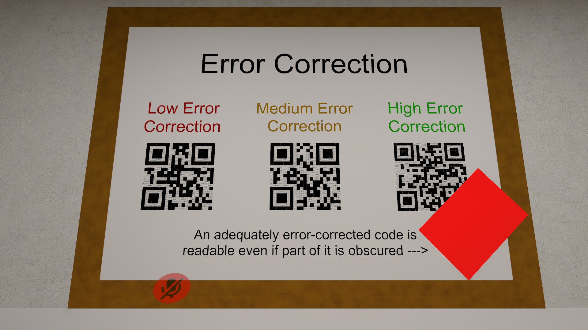
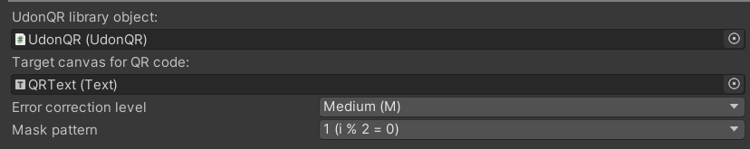
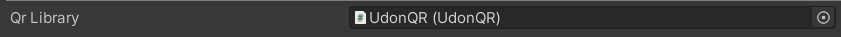

***

<h1 align="center">
<sub>
    
</sub>
</h1>
<p align="center">
<sup>
a library for creating dynamic QR codes in VRChat worlds
</sup>
<br>
<sup>
    <a href="https://vrchat.com/home/world/wrld_c098235d-591e-4580-9a36-4fc09db61a24">See it in VRChat</a>
    (Community Labs pending)
</sup>
</p>

***


<br>
<br>

## How to add the library to your world

Download the latest release from the [releases](https://github.com/Gorialis/vrchat-udon-qr/releases) page.

You need the latest [VRCSDK3-WORLD](https://vrchat.com/home/download) and a copy of [UdonSharp](https://github.com/MerlinVR/UdonSharp/releases).

To use the library in your scene, either drag an instance of the UdonQR prefab into the scene, or add the `UdonBehaviour` component to an existing object and give it the `UdonQR` program source.

**You only need to have one instance of UdonQR in your world. The library object is stateless, and so it is safe for multiple behaviours or objects to use it at once.**


## Using the library in your world (simple method):

The UdonQR package comes with a "QRCanvas" prefab that includes a correctly set up Canvas and Text component configured to display QR codes, as well as a frontend script.

Drag the prefab into your world wherever you wish to display a QR code, and align the canvas such that the text is against a clean white background for the best results.

Make sure to set your UdonQR library object in the script:



**The "QRCanvas" prefab does not include the UdonQR library object within it. You must add it separately as above and set the field in QRCanvas.**

You can set the error correction and mask pattern here as well.

To set the displayed QR code to a given input, add a field to your custom behaviour to reference the frontend script:

```csharp
[SerializeField]
private UdonQRCanvasSetter _qrCanvas;
```

Then use it like this:

```csharp
_qrCanvas.Set(text);
```

Make sure you set the field on your custom behaviour to reference the QRCanvas object.

## Using the library in your world (advanced method)

Add or create the UdonQR library object as described above and add a field to your behaviour to reference the library, like so:

```csharp
[SerializeField]
private UdonQR _qrLibrary;
```

Make sure you set the field to reference the UdonQR prefab, or whichever object holds the program:



You can then use the library from that behaviour as described below.

## API reference

The UdonQR behaviour only contains one public entrypoint. It is as such:

`Create(string input, int error_correction, int mask_pattern, string fill_character, string clear_character) -> string`

> **`string`** `input`: The string to store inside the QR code.
>
> If this is numeric or alphanumeric, the library will automatically detect this and use a more compact encoding within the QR code.

> **`int`** `error_correction`: The level of error correction to use.
>
> The values are as such:
>
> **`ERROR_CORRECTION_L`** = `1`  (Low error correction)
>
> **`ERROR_CORRECTION_M`** = `0`  (Medium error correction)
>
> **`ERROR_CORRECTION_Q`** = `3`  (Medium-high error correction)
>
> **`ERROR_CORRECTION_H`** = `2`  (High error correction)
>
> The numbers here might be confusing, but this is genuinely how they are encoded within the code.
>
> I wanted to have these as accessible named constants, but it confuses Udon.

> **`int`** `mask_pattern`: The mask pattern index to use.
>
> This can be any number from 0 to 7, inclusive.
>
> If you're not sure what to use here, just pick a number you like. There's a chance the same code with a different mask pattern will be picked up by QR code readers more easily, but the logic required to determine this objectively requires **every** mask pattern variant to be generated and individually assessed, so I didn't include automatic detection in this library for performance reasons.

> **`string`** `fill_character`: What text should be used for each 'filled' (black) module in the QR code.
>
> This is used to generate the string output at the end of encoding.
>
> I recommend `\u2588` (FULL BLOCK) as a default. It's a filled black character with the same text metrics as other drawing symbol characters.

> **`string`** `clear_character`: What text should be used for each 'clear' (white) module in the QR code.
>
> This is used to generate the string output at the end of encoding.
>
> I recommend `\u2591` (LIGHT SHADE) as a default. It's a faint interlaced character with the same text metrics as other drawing symbol characters. In the [supplied font](Assets/Gorialis/UdonQR/Fonts), it is entirely invisible.
>
> You may be tempted to use rich text to instead use FULL BLOCK in white. While this does work for small QR codes, using rich text formatting with a per-module frequency in a QR code is liable to hit the Unity 65536 generated mesh limit, which will cause your canvas to stop displaying correctly inexplicably (and with no way to tell this has happened from Udon).
>
> Thus, if you **do** want to go the extra mile to make your QR code look nice, I recommend using a custom font on your canvas text and instead making a special 'blank' character, and use that as your clear string.

## FAQ


### Does this support Unicode?

Yes, it does. This means you can safely use e.g. player usernames in your inputs and get the correct QR code.

Udon does not actually natively expose encoding functions, so a mini-implementation of the conversion is included with the library.

### How fast is it?

The world linked in the header shows a demo of the library in action.

The time taken to generate QR codes depends on the size of the input data involved. Larger amounts of data require more polls to figure out the correct versioning and encoding format, as well as more expensive polynomial calculations for error correction.

Overall, the library is a **lot faster** than you might expect it to be (it was a lot faster than I expected, at least). Players might experience a momentary stutter during generation if their frame rate is high, but this is only a fraction of a second and shouldn't be much of an issue unless you generate frequently.

## Acknowledgements

The library itself does not use or require anything but Udon and UdonSharp.

This README and the sample world uses the Udon logo, which is property of VRChat Inc.
